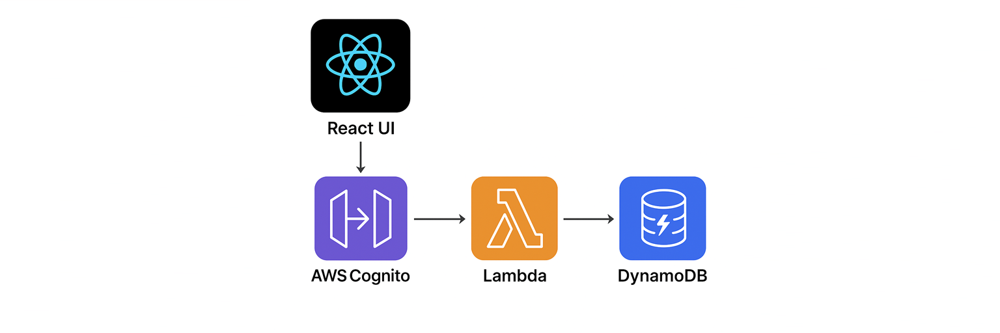
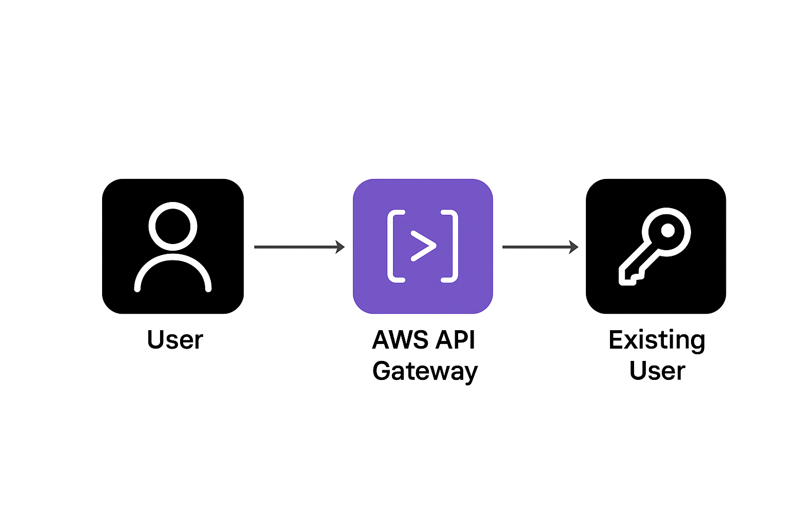

# Lambda-DynamoDB Infra

A **full-stack serverless note-taking platform** powered by **AWS Lambda, DynamoDB, API Gateway, and Cognito**, with a React-based UI.

[](https://codecov.io/github/VictorFajardo/lambda-dynamodb-infra)

---

## ✅ Features

### Core API Endpoints

- `GET /notes` - Fetch all notes
- `GET /notes/{id}` - Fetch a single note by ID
- `POST /notes` - Create a new note
- `PUT /notes/{id}` - Update an existing note
- `DELETE /notes` - Delete a note

### Infrastructure (Provisioned with AWS CDK)

- AWS Lambda (Node.js) with **esbuild bundling**
- Amazon DynamoDB (NoSQL storage)
- API Gateway (REST interface, with **CORS enabled**)
- AWS Cognito for authentication (with auto-login demo flow)
- IAM policies scoped to least privilege
- Outputs API endpoint and resource ARNs for quick onboarding

### Authentication

- **AWS Cognito integration** for user authentication
- **Auto-login functionality**:
  The React UI can automatically log in a demo user and fetch an ID token, eliminating manual steps for first-time testers.

### Testing

- Unit tests using **Jest**
- API testing via **Postman Collection**
- GitHub Actions CI/CD pipeline with automated tests

### Request Validation

- Input validation using **Zod**
- Graceful error handling with structured responses

### Frontend

- React-based UI hosted via GitHub Pages
  👉 [UI — GitHub Pages](https://VictorFajardo.github.io/lambda-dynamodb-ui)

### Observability

- **AWS X-Ray** enabled for request tracing and monitoring
- CloudWatch logs with structured logging

### Security & Best Practices

- Secure **environment variables** for table names, regions, and auth config
- IAM roles with least-privilege access
- Modular architecture for Lambdas and CDK resources

---

## 🏗️ Architecture

Here’s how the system is structured:



- React UI (GitHub Pages) calls API Gateway
- API Gateway routes requests to Lambda
- Lambda functions interact with DynamoDB
- Cognito manages authentication and auto-login
- GitHub Actions handles CI/CD

---

## 🔑 Authentication Flow



- Users authenticate via AWS Cognito
- Tokens are passed automatically to the API (auto-login demo in UI)
- API Gateway verifies identity before invoking Lambdas

---

## 📁 Repositories

| Repository                                                                        | Description                 |
| --------------------------------------------------------------------------------- | --------------------------- |
| [`lambda-dynamodb-infra`](https://github.com/VictorFajardo/lambda-dynamodb-infra) | Core backend infrastructure |
| [`lambda-dynamodb-ui`](https://github.com/VictorFajardo/lambda-dynamodb-ui)       | Frontend React UI           |

---

## 🧪 Local Development

- Use `cdk synth` and `cdk deploy` to bootstrap infrastructure
- Test locally with **Jest** and Postman
- (Optional) Run locally with **AWS SAM** or `serverless-offline`

---

## 🚀 CI/CD

- **GitHub Actions** for build, test, and deploy
- Automated `cdk synth`, `cdk diff`, and `cdk deploy`
- Code coverage reporting with Codecov

---

## 🏁 Getting Started

```bash
git clone https://github.com/VictorFajardo/lambda-dynamodb-infra
cd lambda-dynamodb-infra
npm install
cdk bootstrap
cdk deploy
```

After deployment, check the CDK outputs for:

- API endpoint
- DynamoDB table name
- Cognito user pool info

---

## 🔑 Using Auto-Login in the UI

The frontend includes a **demo auto-login flow**:

1. Open the [UI on GitHub Pages](https://VictorFajardo.github.io/lambda-dynamodb-ui).
2. The app auto-logs in a demo user via Cognito and stores a valid token.
3. Start creating, updating, or deleting notes immediately.

This flow is meant to reduce friction when testing the project.

---

## 📸 Screenshots (Optional)

_(Recommended for portfolio / hiring managers)_
You can add:

- A screenshot of the UI (note list + create form)
- An architecture diagram (Lambda, DynamoDB, API Gateway, Cognito)
- Example Postman request/response

---

## 📄 License

MIT
